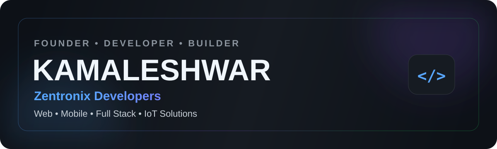

<!--
SETUP:
1. Replace every YOUR_GITHUB_USERNAME value with your exact GitHub username.
2. Replace placeholder project/demo URLs.
3. Keep this repository public and name it exactly the same as your username.
-->

<p align="center">
  
</p>

<h1 align="center">Hi, I'm Kamalesh 👋</h1>

<p align="center">
  <strong>Founder & Lead Developer at Zentronix Developers</strong><br/>
  Building modern websites, web applications, mobile experiences and IoT solutions.
</p>

<p align="center">
  <a href="mailto:zentronixdevelopers@gmail.com">
    
  </a>
  <a href="https://github.com/YOUR_GITHUB_USERNAME">
    
  </a>
  <a href="YOUR_PORTFOLIO_URL">
    
  </a>
</p>

<p align="center">
  
</p>

---

## About Me

I'm **Kamalesh**, the Founder and Lead Developer of **Zentronix Developers**. I enjoy transforming ideas into practical digital products through thoughtful design, clean code and reliable technology.

- Building responsive business websites and full-stack applications
- Exploring mobile development, AI integrations and scalable backends
- Developing IoT prototypes using ESP32, Arduino and Raspberry Pi
- Focused on clean UI, useful features and strong client communication
- Based in Chennai, India

## What I Build

<table>
<tr>
<td width="50%" valign="top">

### Web Experiences
Modern business websites, landing pages, portfolios and responsive interfaces designed to create a strong first impression.

</td>
<td width="50%" valign="top">

### Full-Stack Products
Web applications, dashboards, authentication systems, databases and admin tools built around real business needs.

</td>
</tr>
<tr>
<td width="50%" valign="top">

### Mobile Solutions
Practical mobile application concepts and connected admin experiences for managing websites and services.

</td>
<td width="50%" valign="top">

### IoT & Automation
Sensor-based systems, ESP32 prototypes, Raspberry Pi integrations and automation projects that solve real-world problems.

</td>
</tr>
</table>

## Tech Stack

### Frontend
<p>
  
</p>

### Backend & Databases
<p>
  
</p>

### Tools & Deployment
<p>
  
</p>

### IoT
<p>
  
</p>

## Featured Projects

| Project | Description | Stack | Links |
|---|---|---|---|
| **Zentronix Portfolio** | Professional company portfolio showcasing services, projects and client-focused solutions. | React / Next.js / Supabase | [Repository](https://github.com/YOUR_GITHUB_USERNAME/zentronix-portfolio) · [Live Demo](YOUR_DEMO_URL) |
| **Wedding Rental Platform** | Premium wedding blazer rental showcase with enquiry and booking-focused user experience. | HTML / CSS / JavaScript | [Repository](https://github.com/YOUR_GITHUB_USERNAME/wedding-rental-platform) · [Live Demo](YOUR_DEMO_URL) |
| **Jewellery Showcase** | Elegant jewellery catalogue with product display, ordering and admin management concepts. | JavaScript / Supabase | [Repository](https://github.com/YOUR_GITHUB_USERNAME/jewellery-showcase) · [Live Demo](YOUR_DEMO_URL) |
| **Construction Builder Website** | Cinematic builder portfolio designed to present projects and generate client enquiries. | React / GSAP | [Repository](https://github.com/YOUR_GITHUB_USERNAME/construction-builder) · [Live Demo](YOUR_DEMO_URL) |
| **AgroDose ATM** | IoT fertilizer recommendation and dispensing prototype using soil sensor readings. | ESP32 / Raspberry Pi / Arduino | [Repository](https://github.com/YOUR_GITHUB_USERNAME/agrodose-atm) |
| **Scribemate** | A productivity-focused digital project designed around simple and useful workflows. | Web Development | [Repository](https://github.com/YOUR_GITHUB_USERNAME/scribemate) |

> Replace unavailable links with real URLs before publishing. Remove projects that do not yet have presentable code, screenshots or documentation.

## GitHub Analytics

<p align="center">
  
  
</p>

<p align="center">
  
</p>

## Contribution Activity

<p align="center">
  
</p>

## Current Focus

```text
Building     Zentronix Developers and client-ready digital products
Learning     Advanced full-stack development, AI integration and system design
Improving    Project documentation, reusable components and deployment workflows
Exploring    Mobile applications, automation and connected IoT systems
```

## Professional Principles

- Build for real user needs, not only visual appearance
- Keep interfaces simple, responsive and accessible
- Document projects so others can understand and run them
- Communicate scope, progress and limitations honestly
- Continue learning through practical projects

## Connect With Me

<p align="center">
  <a href="mailto:zentronixdevelopers@gmail.com"><strong>Email</strong></a>
  &nbsp;•&nbsp;
  <a href="YOUR_LINKEDIN_URL"><strong>LinkedIn</strong></a>
  &nbsp;•&nbsp;
  <a href="YOUR_PORTFOLIO_URL"><strong>Portfolio</strong></a>
  &nbsp;•&nbsp;
  <a href="YOUR_INSTAGRAM_URL"><strong>Instagram</strong></a>
</p>

<p align="center">
  <em>Building modern digital experiences through creativity, code and continuous learning.</em>
</p>
